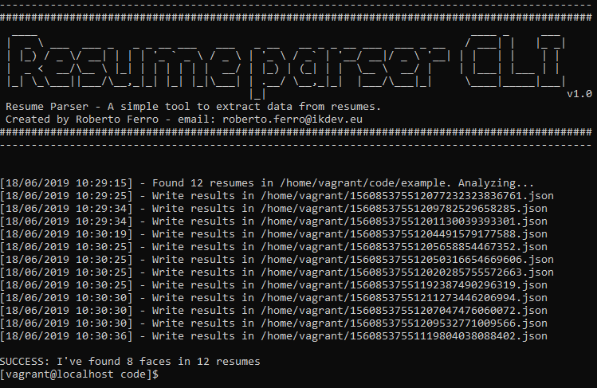

# ResumeParser.js
Simple tool to extract data from resumes.

 

## Requirements
* Node.js
* Libreoffice
* Python 2.7/3.*

## Installation
First clone the repository and install all dependency
```
git clone https://github.com/RobyFerro/ResumeParser.js.git
npm install
```

### Linux dependencies
##### cmake 
###### Fedora:
    yum install cmake
###### Debian:
    apt-get install cmake
##### libopenblas-dev
OPTIONAL Install for improve CPU performance during face recognition:  
###### Fedora:
    yum install openblas-devel.x86_64
###### Debian: 
    sudo apt-get install libopenblas-dev
##### libx11 (XQuartz on OSX)
###### Fedora:
    yum install libX11-devel.x86_64
###### Debian:
    sudo apt-get install libx11-dev
##### libpng 
###### Fedora:
    yum install libpng-devel
###### Debian:
    sudo apt-get install libpng-dev
##### pdftotext 
###### Fedora: 
    yum install poppler-utils
###### Debian:
    sudo apt-get install poppler-utils
##### antiword 
###### Fedora:
    wget https://forensics.cert.org/cert-forensics-tools-release-el7.rpm
    rpm -Uvh cert-forensics-tools-release*rpm
    yum --enablerepo=forensics install antiword
###### Debian: 
    sudo apt-get install antiword
##### unrtf
###### Fedora:
    yum install unrtf
###### Debian:
    sudo apt-get install unrtf
##### tesseract 
###### Fedora:
    yum install tesseract
###### Debian:
    sudo apt-get install tesseract-ocr
    
## Python dependency:
Install face recognition dependency with
```
pip install face_recognition
```

## CLI Usage

```
node src/parser.js -d <RESUMES-DIRECTORY> -eD <EXPORT-RESULT-DIR> 
```

### Options

###### -d [value] / --dir [value] : default "none"
Specific source directory. Use this option to parse multiple resumes.
###### -f [value] / --file [value] : default "none"
Used to parse single resume
###### -eD [value] / --extract-data [value] : default "as configured in config.js"
Specific an output directory. Every results will be placed here.
###### -oN [value] / --output-name [value] : default "Timestamp + random hash auto generated"
Option available only with -f/--file option. Used to specific an output file name.
###### -v / --verbose : default "false"
Show verbose information

## Server usage
ResumeParser.js includes an express web server that allow you to parse a single resume just calling an HTTP service.
To start web server just run this command in root directory:
```
npm start
```

### Available apis
###### POST: [YOURDOMAIN]:3000/parse
Send a resume in this route. Return a JSON object which contains every information about it.

